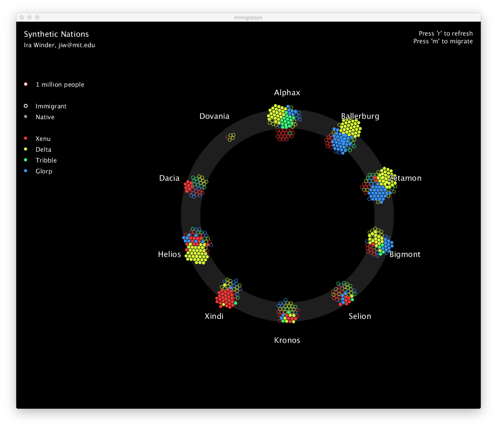

# Immigration
A Visualization Framework to test immigration policy among synthetic nation-states

Directions:

1. Download Processing v2.2.1
https://processing.org/download/?processing

2. Confirm Lastest Java is Installed
https://java.com/en/download/mac_download.jsp

3. Clone Repository, run "Immigration.pde" in Processing. Press "Run."
